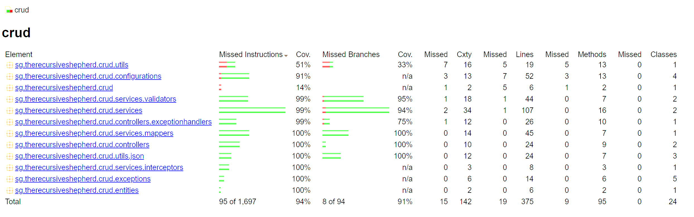
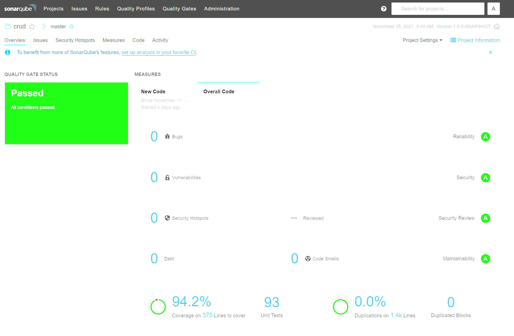
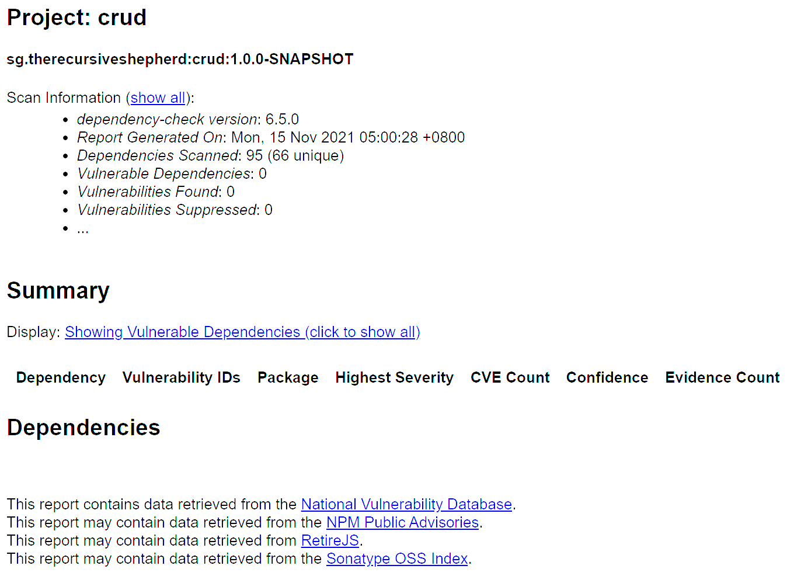

# Employee API - A CRUD API over a Database

## Requirements

This project requires JDK 11.0.13 to build and PostgreSQL to run. Port 8080 must be available.

## Building the Application

Run `mvn clean verify` to build, test, and scan the application. This results in the following artifacts:

- `target/crud-{version}.jar`: The application itself. "{version}" in the filename is replaced by the application version from pom.xml.
- `target/site/jacoco/index.html`: Code coverage report. View this in a browser.
- `target/dependency-check-report.html`: OWASP Dependency Checker report. As part of the build process, the dependency checker downloads and caches the NIST Vulnerability Database locally and checks the application's dependencies against it. CVEs related to dependencies will show up here.

Should a SonarQube server be available, edit `sonarscan.bat` with the host url, project key, and token. Run it to trigger the code analysis.

## Preparing the Database

As a database user with user and database creation privileges, do the following.

- Create a user for the application, e.g. from the psql console, run `CREATE USER employeeapi WITH ENCRYPTED PASSWORD 'password123';`
- Create a database for the application, e.g. from the psql console, run `CREATE DATABASE employeeapi;`
- Grant the user sufficient privileges on the database for operations, e.g. from the psql console, run `GRANT ALL PRIVILEGES ON DATABASE employeeapi TO employeeapi;`

## Preparing the Environment

The application's settings can be overridden by environment variables. The following are some variables you may need to set.

- `SPRING_SQL_INIT_MODE`: Set this to `always` to get the application to create the required table(s) on startup. This will fail if the table already exists. It will not drop the table, should there be data that is required to be preserved. You may wish to set this to always on the first run, to create the necessary database table(s), then revert this to never.
- `READ_DATASOURCE_JDBCURL`: Connection string for the read-only API, e.g. `jdbc:postgresql://localhost:5432/employeeapi`
- `READ_DATASOURCE_USERNAME`: Username for the read-only API
- `READ_DATASOURCE_PASSWORD`: Password for the read-only API
- `WRITE_DATASOURCE_JDBCURL`: Connection string for the write API, e.g. `jdbc:postgresql://localhost:5432/employeeapi`
- `WRITE_DATASOURCE_USERNAME`: Username for the write API
- `WRITE_DATASOURCE_PASSWORD`: Password for the write API

## Running the Application

After building the application, run the following command from the project's root directory:

- On Windows: `java -jar target\crud-1.0.0-SNAPSHOT.jar --spring.profiles.active={comma-delimited list of profiles to set}`
- On Linux/MacOS: `java -jar ./target/crud-1.0.0-SNAPSHOT.jar --spring.profiles.active={comma-delimited list of profiles to set}`

The following profiles are available:

- `dev`: Enables the logging of SQL statements, metrics, and Swagger API documentation
- `read`: Enables the read-only APIs of the application
- `write`: Enables the write / update / delete APIs of the application

For example, running `java -jar target\crud-1.0.0-SNAPSHOT.jar --spring.profiles.active=read,write` would enable all the APIs in the application, but no Swagger API documentation will be available.

Alternatively, for development, one may instead run `mvn spring-boot:run -Dspring-boot.run.profiles=dev,read,write`. Note that this will drop and re-create the table(s) in the database

## Usage

For the most updated API documentation, one should start the application with the dev profile and navigate to [http://localhost:8080/swagger-ui/index.html](http://localhost:8080/swagger-ui/index.html).

It is also possible to import the Postman collection found in the project's root directory and use Postman to issue requests.

Some notes on the API:

- `POST /users/upload`: The field name for the file upload is `file`. If an employee's name includes a comma, the whole name should be quoted, e.g. `"Tan Ah Kow, Bob"` and not simply `Tan Ah Kow, Bob`. 
- An employee's salary cannot be specified with greater than 20 digits, and no more than 4 decimal places, included within the 20 digit maximum.

### Quick Documentation on Available Endpoints

All endpoints here respond with a mimetype of application/json.

- `GET /users`: Fetches all employee data, sorted by id ascending, with a minimum salary of 0 (inclusive) and 4000.00 (exclusive). One may issue the following query parameters to filter/sort results:
  - `login`: searches for records with login matching exactly the supplied value. As login is unique, this can only return at most 1 record. 
  - `name`: searches for records with names containing the supplied value. This search is case-sensitive.
  - `minSalary` and/or `maxSalary`: Values supplied must be numeric. Searches for records greater than or equal to minSalary and less than maxSalary (exclusive). If either is not supplied, a default of 0 is used for minSalary or 4000.00 for maxSalary.
  - `minStartDate` and/or `maxStartDate`: Values supplied must be of the format yyyy-MM-dd. Searches for records with startDate on or later than minStartDate and before maxStartDate (exclusive). If either is not supplied, a default of 1900-01-01 is used for minStartDate or 3000-12-31 for maxStartDate.
  - `sortBy`: Valid values are id, login, name, salary, and startDate. Specifies the column to sort by. The default sort column is id.
  - `sortDir`: Valid values are asc and desc, for ascending and descending respectively. The default sort order is ascending. *Note: if sortBy and sortDir are specified, the results will be sorted accordingly, then sorted by id ascending to ensure a stable sorting behaviour across paginated queries.*
  - `offset`: Skips the first specified number of results
  - `limit`: The maximum number of results to return
- `GET /users/{id}`: Fetches data for a single employee
- `POST /users`: Accepts a JSON request body containing valid data in full for an employee and creates it. This is not idempotent in the sense that sending another request to create an employee with the same id results in an error response. However, the data on the server remains unchanged on repeated submission. The request body must be valid according to the rules under the Employee Data Validation section.
- `PUT /users/{id}`: Accepts a JSON request body containing valid data in full for an employee with the given id and replaces all its values, creating it if the employee did not previously exist. This is an idempotent operation. **Although RFC 7231 requires a successful resource creation to result in a http response status of 201, a status of 200 is returned here instead due to the exercise specifications.** The request body must be valid according to the rules under the Employee Data Validation section. Additionally, the id in the request body must match the id in the path.
- `PATCH /users/{id}`: Accepts a partial JSON diff for an existing employee with the given id and applies changes only to the fields in the JSON. Due to the non-nullability of domain data, this operation happens to be idempotent. If supplied, the id in the JSON diff must be identical to the id in the path.
- `DELETE /users/{id}`: Deletes the record of the employee with the id given in the path
- `POST /users/upload`: Uploads a CSV file containing employee data. The file must meet the specifications in the following section, with the updating process subject to the attendant caveats.

### CSV File Specifications

The CSV file uploaded to `/users/upload` must meet the following requirements

- The file size must be less than 60mb
- A header row must be present and must be equal to "id,login,name,salary,startDate" in order for data mapping to succeed
- Character encoding used in the file must be UTF-8
- Lines starting with a `#` character will not be processed
- All 5 columns must contain data
- If any field contains a comma, the field must be quoted, i.e. `"Lim Kopi, Bryan"` and not `Lim Kopi, Bryan`
- An employee's record is identified uniquely by its id column. No two rows shall have the same id
- Employees' login data are unique. No two rows in the file shall have the same login, and each login must not currently belong to another record in the database.
- The data in each row is validated according to the specifications in the next section, identical to validation steps used in the RESTful creation and updating of records.

#### Notes ####
1. If a row contains an id that is already present in the database, the corresponding database record will updated. If the id is not already present in the database, a new record is inserted.

2. It is permissible to swap two users' logins in a single CSV file upload.

3. It is not possible to change a user's id using the CSV file upload. Changing the id of a row results in a new record being created as per (1) above. 

### Employee Data Validation

- The id field must be a non-blank string
- The login field must be a non-blank string
- The name field must be a non-blank string
- The salary field must be a non-negative decimal
- The startDate field must be a date in either yyyy-MM-dd or dd-MMM-yy format

## Architecture Design Record

| Issue | Decision |
| --- | --- |
| **CSV File Upload Size Limit** Unbounded file sizes are unacceptable for multipart file uploads to a web server, allowing a malicious actor to consume all of a server's resources, e.g. disk space, thread pools, etc.  | The multipart file size limit has been set to 60mb. This was around the size of a CSV with slightly over 1 million employees. For comparison, Amazon has roughly 1.5 million employees. |
| **Database connection pooling strategy**. Write operations may take a long time to complete, especially for large CSV files. Multiple concurrent such operations can exhaust the database connection pool, preventing data from being read. | A read-only connection pool is used for queries, while a separate connection pool is used for commands. These are enabled via profiles, thus allowing one to better scale horizontally when needed. |
| **Monetary value precision (for salary field).** Monetary values, e.g. salaries, should not be processed or stored as simple floats or doubles due to precision loss. | To store this field as a BigDecimal in the application and use a precision of 20 and scale of 4. In the database, this is a decimal type. ISO 4217 currency data shows most currencies with 2 or 3 decimal digits, with a single exception of one of Uruguay's currencies. This will have to be revised if cryptocurrency support is expected. However, the serialized values are rounded off to 2 decimal places as required by the exercise's specifications. |
| **PATCH request support.** RFC 5789 specifies that PATCH requests accept a request describing a set of changes and applies a partial modification to the resource. When using normal DTOs in Java, there is no way to distinguish between null and undefined values in JSON as RFC 7386 requires in such patch documents. Using a hashmap as a DTO may address this, at the cost of data mapping and validation complexity. Another solution is to wrap each field in an Optional as Jackson handles it properly, but Optionals are not designated as serializable and may thus cause future maintenance issues. | To deserialize patch documents as DTOs and take no action given null fields. While this deviates from RFC 7386 which would require the corresponding field in the employee's record to be set to null, all fields in an employee's record are required, so the alternative would have been to throw an exception due to the inability to easily discern the user's intent. |
| **Conflicts between CSV data and database.** A CSV file contains updates for multiple records at once. Taken as single transaction, the possibility exists to swap two employees' login fields, something not possible if each row is taken as a separate transaction to be committed. However, this defers the unique constraint check to the database update step. A conflicting login value next results in a SQL exception, and pinpointing the exact record with the conflict at this step requires interpreting the SQL error message, possibly via regex. Attempting to pinpoint the conflicting row before this would require a database query per row using id/login tuples, resulting in a significant performance hit from the n+1 queries with large CSV files. | To "ask for forgiveness rather than check", and return an error message indicating a conflict in the login field in the CSV file if a non-transient data access error is encountered on upsert. |
| **Service resiliency**. A production-ready database likely resides over the network, and network connections are not reliable. However, a naive retry policy is dangerous without a circuit breaker and could lead to inadvertent self-DDOS. Circuit breakers are necessarily stateful and do not scale in a straightforward manner. | To retry at most once per database operation, with random backoff jitter to mitigate systemic traffic spikes |
| **Validation at controller vs service**. Data validation here is part of the business logic and should rightfully reside in the service classes. Service classes could be more easily re-used elsewhere if so. However, the single data ingestion point is from the controller, and arguably the unit of reusability is the entire application itself. Using JSR303 annotations and validators makes the validation logic portable, and having validation done by Spring prior to data coming into the controller ensures data validity within the boundary of the application and makes for more effective defensive programming. | To enforce data validation using only JSR303-compliant annotations and validators. Conversion of request parameters to Java types is to be done via Spring Converters pre-controller input to ensure correctness of data within the application.|
| **Database optimization strategies** Filtering by name here requires a full-text search in the name column. This is an expensive operation, especially for larger datasets. | A btree index is to be created on the name column. Should the dataset grow sufficiently large, e.g. on the order of a million entries, this may require a redesign to use the more complicated trigram index instead.|

## Last Code Quality Scan Results

### Jacoco Test Coverage Report

### SonarQube Code Analysis Report

### OWASP Dependency Check Report

## Suggested Improvements

- For better reproducible builds and smaller deployment footprint, use a multi-stage Docker build. From the first container, install JDK 11.0.13 and use jlink to create a minimal JRE consisting only of classes required to run the application, stripping off problematic classes (e.g. SecurityManager). Use the JDK within the container to build the jar file, then copy the JRE and the jar file to a target deployment image based on Google's Distroless image to reduce the threat surface by keeping only essential libraries for the application's process.
- Distributed cache for Hibernate's L2 to facilitate scaling.
- Implement a query id column for employee data so that the /users/{id} endpoint does not use the database id. The id currently follows a predictable pattern and could lead to IDOR vulnerabilities. However, this would require more context beyond the scope of this exercise, e.g. how the frontend wishes to query for records.
- The use of Spring Data Jpa and its query autogeneration is acceptable for small domain boundaries, but is not easily scalable. Some workarounds have been implemented to confine the number of query methods required, but these have some small impact on query performance. For example, the lower and upper limits of salaries and start dates are always specified in queries, which causes additional checks by the database. Should more fields be required in each row or normalization of tables be consequently required, it may be prudent to use Specification builders, or alternatively, Jooq to generate dynamic queries without string concatenation which could expose the application to SQL injection attacks. 
